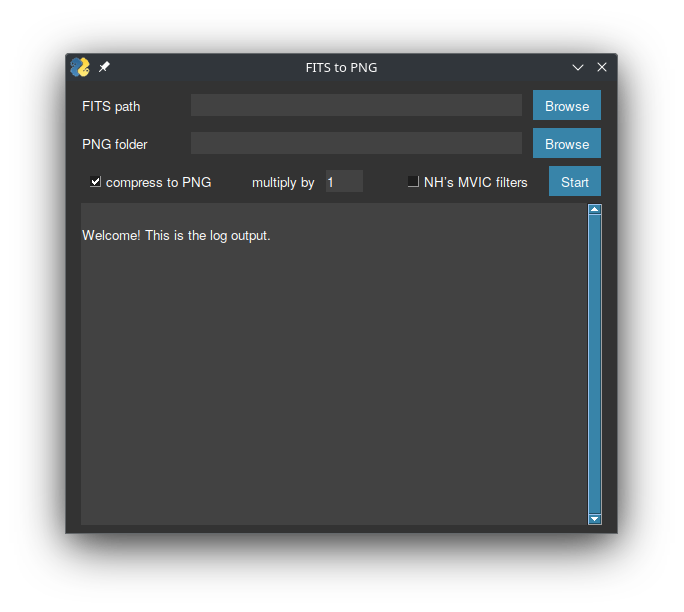

# fits2png
A small GUI program for converting space images.

## Installation

Python version 3.9 or higher is required. On Linux, you may need to replace the `python` command with `python3`.

**Step Zero**: Clone the repository or download the archive using the GitHub web interface. In the console, go to the project root folder.

### Simple installation
1. Install the dependencies with `pip install -r requirements.txt`;
2. Execute `python -u fits2png.py`.

### In virtual environment
1. Create a virtual environment with `python -m venv .venv`;
2. Install the dependencies with `.venv/bin/pip install -r requirements.txt`;
3. Execute `.venv/bin/python -u fits2png.py`.

## Notes

- To save the output without compression (in TIFF format), release the button `compress to PNG`;
- To recognize New Horizon's MVIC image and apply the conversion factor, the appropriate button must be pressed and the file name must begin with `mc0`, `mc1`, `mc2` or `mc3`. This is the default behavior for files from [OPUS](https://opus.pds-rings.seti.org/).
